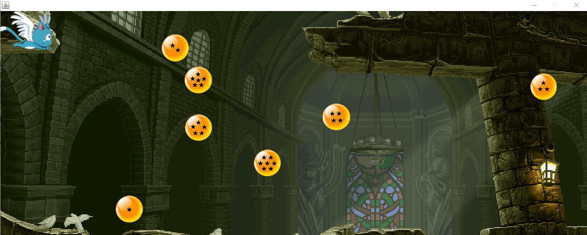

# Projeto Java utilizando os conceitos aprendidos na cadeira de Técnicas de programação do Centro Universitário Farias Brito.

- Contexto do jogo
  
O personagem principal é o <b>happy do anime Fairy Tail</b>. O objetivo do game é coletar as <b>7 esferas do dragão</b> dispesas em diferente coordenadas do cenário.
  

  

  
<h2>Recursos do java Utilizado<h2>

  <ul>
    <li> Herança e implementação de classes</li>
    <li>Exceptions</li>
    <li>Threads</li>
    <li>leitura e escrita de objetos em arquivos</li>
    <li>ArrayList</li>
</ul>

